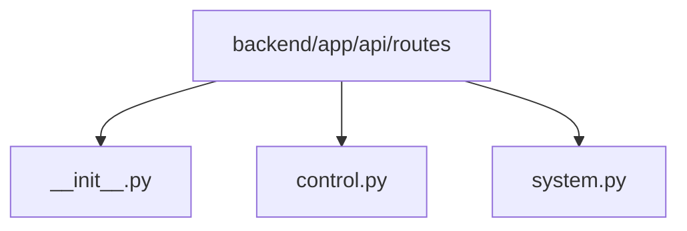

# Module: `backend/app/api/routes`

## Overview
Route handlers that implement control ingestion and system/operations endpoints.

## Architecture Diagram

## Submodules
| Submodule | Source | Kind |
| --- | --- | --- |
| `__init__.py` | `backend/app/api/routes/__init__.py` | Python module |
| `control.py` | `backend/app/api/routes/control.py` | Python module |
| `system.py` | `backend/app/api/routes/system.py` | Python module |

## Routes
| Method | Path | Handler | Source |
| --- | --- | --- | --- |
| `POST` | `/api/v1/control/frame` | `ingest_frame` | `backend/app/api/routes/control.py` |
| `POST` | `/api/v1/control/telemetry` | `ingest_telemetry` | `backend/app/api/routes/control.py` |
| `GET` | `/health` | `health` | `backend/app/api/routes/system.py` |
| `GET` | `/version` | `version` | `backend/app/api/routes/system.py` |
| `POST` | `/estop` | `activate_estop` | `backend/app/api/routes/system.py` |
| `DELETE` | `/estop` | `clear_estop` | `backend/app/api/routes/system.py` |
| `GET` | `/estop` | `estop_status` | `backend/app/api/routes/system.py` |

## Functions
### `backend/app/api/routes/control.py`
- `build_stop_command(trace_id: UUID, session_id: UUID, seq: int, reason_code: str, message: str, backend_latency_ms: int, model_latency_ms: int, safe_to_execute: bool) -> CommandResponse` (function) — Build a deterministic STOP command payload for safety fallback paths.
- `_ensure_session(db_url: str, session_id: UUID, device_id: str, prompt_version: str, model_name: str, timestamp_ms: int) -> None` (function) — Create a SessionRecord if one does not already exist for this session_id.
- `ingest_frame(request: Request, settings: Annotated[AppSettings, Depends(get_app_settings)], inference_adapter: Annotated[InferenceAdapter, Depends(get_inference_adapter)], prompt_manager: Annotated[PromptManager, Depends(get_prompt_manager)], output_parser: Annotated[StructuredOutputParser, Depends(get_output_parser)], decision_policy: Annotated[DecisionPolicy, Depends(get_decision_policy)], image: UploadFile = File(...), device_id: str = Form(...), session_id: UUID | None = Form(default=None), seq: int = Form(...), timestamp_ms: int = Form(...), frame_width: int = Form(...), frame_height: int = Form(...), jpeg_quality: int = Form(...), battery_mv: int | None = Form(default=None), mode: DeviceMode = Form(...), firmware_version: str | None = Form(default=None), ir_left: float | None = Form(default=None), ir_right: float | None = Form(default=None), gps_lat: float | None = Form(default=None), gps_lon: float | None = Form(default=None)) -> CommandResponse` (async function) — Receive all bot telemetry and frame data, return a predetermined action command.
- `ingest_telemetry(settings: Annotated[AppSettings, Depends(get_app_settings)], payload: TelemetryPayload) -> dict[str, object]` (function) — Receive periodic telemetry from the bot and persist for monitoring.

### `backend/app/api/routes/system.py`
- `health(settings: Annotated[AppSettings, Depends(get_app_settings)]) -> dict[str, object]` (function) — Liveness endpoint for backend and edge connectivity checks.
- `version(settings: Annotated[AppSettings, Depends(get_app_settings)]) -> dict[str, object]` (function) — Return backend and model version metadata.
- `activate_estop(request: Request) -> dict[str, object]` (function) — Activate remote emergency stop. All subsequent commands will be STOP.
- `clear_estop(request: Request) -> dict[str, object]` (function) — Clear remote emergency stop. Normal operation resumes.
- `estop_status(request: Request) -> dict[str, object]` (function) — Return current remote emergency stop state.
