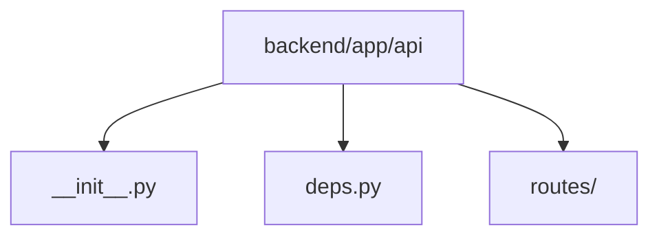

# Module: `backend/app/api`

## Overview
HTTP-facing API layer that exposes dependency providers and route registration for the backend service.

## Architecture Diagram

## Submodules
| Submodule | Source | Kind |
| --- | --- | --- |
| `__init__.py` | `backend/app/api/__init__.py` | Python module |
| `deps.py` | `backend/app/api/deps.py` | Python module |
| `routes/` | `backend/app/api/routes` | Nested package/directory |

## Routes
This module does not declare HTTP routes.

## Functions
### `backend/app/api/deps.py`
- `get_app_settings(request: Request) -> AppSettings` (function) — FastAPI dependency to retrieve shared application settings.
- `get_inference_adapter(request: Request) -> InferenceAdapter` (function) — FastAPI dependency to retrieve configured inference adapter.
- `get_prompt_manager(request: Request) -> PromptManager` (function) — FastAPI dependency to retrieve prompt manager singleton.
- `get_output_parser(request: Request) -> StructuredOutputParser` (function) — FastAPI dependency to retrieve structured model output parser.
- `get_decision_policy(request: Request) -> DecisionPolicy` (function) — FastAPI dependency to retrieve decision policy singleton.
