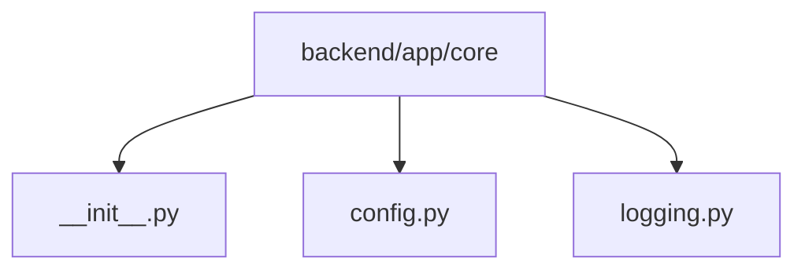

# Module: `backend/app/core`

## Overview
Runtime configuration and logging primitives shared across the backend.

## Architecture Diagram

## Submodules
| Submodule | Source | Kind |
| --- | --- | --- |
| `__init__.py` | `backend/app/core/__init__.py` | Python module |
| `config.py` | `backend/app/core/config.py` | Python module |
| `logging.py` | `backend/app/core/logging.py` | Python module |

## Routes
This module does not declare HTTP routes.

## Functions
### `backend/app/core/config.py`
- `get_settings() -> AppSettings` (function) — Return cached settings for process-wide use.

### `backend/app/core/logging.py`
- `configure_logging(log_level: str) -> None` (function) — Configure process logging with JSON output to stdout.
