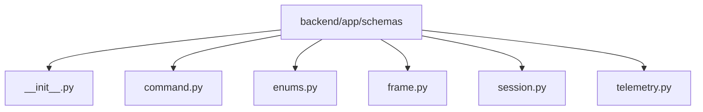

# Module: `backend/app/schemas`

## Overview
Pydantic schema models that mirror backend-to-edge contracts.

## Architecture Diagram

## Submodules
| Submodule | Source | Kind |
| --- | --- | --- |
| `__init__.py` | `backend/app/schemas/__init__.py` | Python module |
| `command.py` | `backend/app/schemas/command.py` | Python module |
| `enums.py` | `backend/app/schemas/enums.py` | Python module |
| `frame.py` | `backend/app/schemas/frame.py` | Python module |
| `session.py` | `backend/app/schemas/session.py` | Python module |
| `telemetry.py` | `backend/app/schemas/telemetry.py` | Python module |

## Routes
This module does not declare HTTP routes.

## Functions
No top-level functions were detected in this module.
