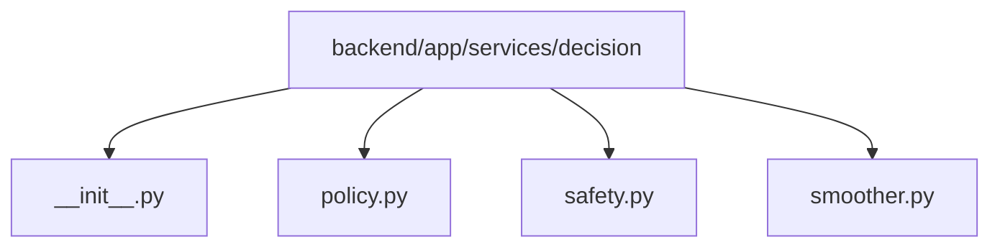

# Module: `backend/app/services/decision`

## Overview
Decision post-processing utilities that convert parsed model output into safe motor commands.

## Architecture Diagram

## Submodules
| Submodule | Source | Kind |
| --- | --- | --- |
| `__init__.py` | `backend/app/services/decision/__init__.py` | Python module |
| `policy.py` | `backend/app/services/decision/policy.py` | Python module |
| `safety.py` | `backend/app/services/decision/safety.py` | Python module |
| `smoother.py` | `backend/app/services/decision/smoother.py` | Python module |

## Routes
This module does not declare HTTP routes.

## Functions
### `backend/app/services/decision/safety.py`
- `apply_safety_overrides(decision: ParsedDecision, min_confidence: float, estop_active: bool) -> SafetyOutcome` (function) — Apply deterministic safety rules before command shaping.

### `backend/app/services/decision/smoother.py`
- `clamp_pwm(value: int) -> int` (function) — Clamp PWM to valid 8-bit motor controller range.
