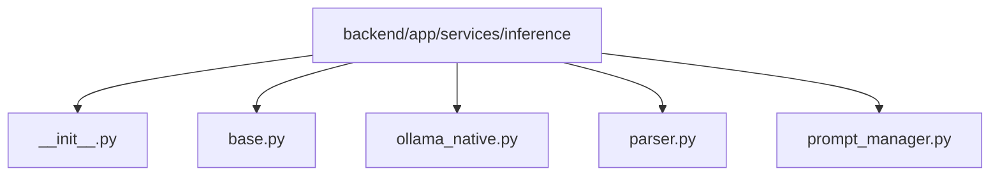

# Module: `backend/app/services/inference`

## Overview
Inference abstractions, prompt construction, response parsing, and Ollama adapter implementation.

## Architecture Diagram

## Submodules
| Submodule | Source | Kind |
| --- | --- | --- |
| `__init__.py` | `backend/app/services/inference/__init__.py` | Python module |
| `base.py` | `backend/app/services/inference/base.py` | Python module |
| `ollama_native.py` | `backend/app/services/inference/ollama_native.py` | Python module |
| `parser.py` | `backend/app/services/inference/parser.py` | Python module |
| `prompt_manager.py` | `backend/app/services/inference/prompt_manager.py` | Python module |

## Routes
This module does not declare HTTP routes.

## Functions
No top-level functions were detected in this module.
