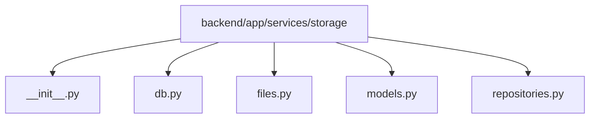

# Module: `backend/app/services/storage`

## Overview
SQLite and filesystem persistence helpers for sessions, frames, decisions, telemetry, and errors.

## Architecture Diagram

## Submodules
| Submodule | Source | Kind |
| --- | --- | --- |
| `__init__.py` | `backend/app/services/storage/__init__.py` | Python module |
| `db.py` | `backend/app/services/storage/db.py` | Python module |
| `files.py` | `backend/app/services/storage/files.py` | Python module |
| `models.py` | `backend/app/services/storage/models.py` | Python module |
| `repositories.py` | `backend/app/services/storage/repositories.py` | Python module |

## Routes
This module does not declare HTTP routes.

## Functions
### `backend/app/services/storage/db.py`
- `_connect_args_for_url(database_url: str) -> dict[str, bool]` (function) — No inline docstring/comment summary found.
- `get_engine(database_url: str) -> Engine` (function) — Return a cached SQLAlchemy engine for the target database URL.
- `get_session_factory(database_url: str) -> sessionmaker[Session]` (function) — Return a cached session factory for the selected database.
- `init_db(database_url: str) -> None` (function) — Create missing tables for all ORM models.
- `session_scope(database_url: str) -> Iterator[Session]` (function) — Context-managed transactional session helper for repositories.
- `clear_cached_db_handles() -> None` (function) — Reset cached engine/session makers, useful for tests.

### `backend/app/services/storage/models.py`
- `now_ms() -> int` (function) — Return current Unix time in milliseconds.
