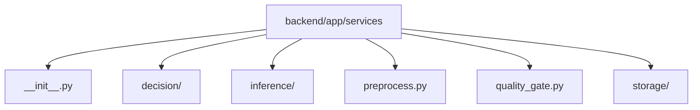

# Module: `backend/app/services`

## Overview
Business-logic services for preprocessing, quality checks, inference orchestration, and storage.

## Architecture Diagram

## Submodules
| Submodule | Source | Kind |
| --- | --- | --- |
| `__init__.py` | `backend/app/services/__init__.py` | Python module |
| `decision/` | `backend/app/services/decision` | Nested package/directory |
| `inference/` | `backend/app/services/inference` | Nested package/directory |
| `preprocess.py` | `backend/app/services/preprocess.py` | Python module |
| `quality_gate.py` | `backend/app/services/quality_gate.py` | Python module |
| `storage/` | `backend/app/services/storage` | Nested package/directory |

## Routes
This module does not declare HTTP routes.

## Functions
### `backend/app/services/preprocess.py`
- `_compute_blur_score(gray_array: np.ndarray) -> float` (function) — No inline docstring/comment summary found.
- `_quality_score(mean_brightness: float, contrast: float, blur_score: float) -> float` (function) — No inline docstring/comment summary found.
- `preprocess_frame(image_bytes: bytes) -> PreprocessResult` (function) — Decode JPEG, normalize color space, and compute quality metrics.

### `backend/app/services/quality_gate.py`
- `evaluate_quality(metrics: FrameQualityMetrics, min_quality_score: float, min_brightness: float, max_brightness: float, min_blur_score: float) -> QualityGateDecision` (function) — Apply deterministic quality checks and return STOP rationale when rejected.
