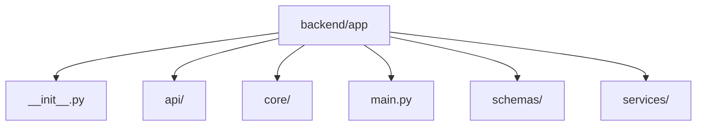

# Module: `backend/app`

## Overview
FastAPI application package that wires together API routes, configuration, schemas, decision services, and persistence.

## Architecture Diagram

## Submodules
| Submodule | Source | Kind |
| --- | --- | --- |
| `__init__.py` | `backend/app/__init__.py` | Python module |
| `api/` | `backend/app/api` | Nested package/directory |
| `core/` | `backend/app/core` | Nested package/directory |
| `main.py` | `backend/app/main.py` | Python module |
| `schemas/` | `backend/app/schemas` | Nested package/directory |
| `services/` | `backend/app/services` | Nested package/directory |

## Routes
This module does not declare HTTP routes.

## Functions
### `backend/app/main.py`
- `create_app(settings: AppSettings | None = None) -> FastAPI` (function) — Create and configure the FastAPI application instance.
