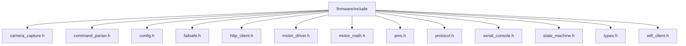

# Module: `firmware/include`

## Overview
Firmware header interfaces that define embedded subsystem contracts and shared constants.

## Architecture Diagram

## Submodules
| Submodule | Source | Kind |
| --- | --- | --- |
| `camera_capture.h` | `firmware/include/camera_capture.h` | C++ header |
| `command_parser.h` | `firmware/include/command_parser.h` | C++ header |
| `config.h` | `firmware/include/config.h` | C++ header |
| `failsafe.h` | `firmware/include/failsafe.h` | C++ header |
| `http_client.h` | `firmware/include/http_client.h` | C++ header |
| `motor_driver.h` | `firmware/include/motor_driver.h` | C++ header |
| `motor_math.h` | `firmware/include/motor_math.h` | C++ header |
| `pins.h` | `firmware/include/pins.h` | C++ header |
| `protocol.h` | `firmware/include/protocol.h` | C++ header |
| `serial_console.h` | `firmware/include/serial_console.h` | C++ header |
| `state_machine.h` | `firmware/include/state_machine.h` | C++ header |
| `types.h` | `firmware/include/types.h` | C++ header |
| `wifi_client.h` | `firmware/include/wifi_client.h` | C++ header |

## Routes
This module does not declare HTTP routes.

## Functions
### `firmware/include/camera_capture.h`
- `camera_capture_init()` (function) — No inline docstring/comment summary found.
- `camera_capture_frame(FrameBuffer& out_frame)` (function) — No inline docstring/comment summary found.
- `camera_capture_release()` (function) — No inline docstring/comment summary found.

### `firmware/include/command_parser.h`
- `command_parser_parse(const String& payload, MotionCommand& out_command, String& out_error)` (function) — No inline docstring/comment summary found.

### `firmware/include/failsafe.h`
- `failsafe_init()` (function) — No inline docstring/comment summary found.
- `failsafe_kick()` (function) — No inline docstring/comment summary found.
- `failsafe_update_inputs()` (function) — No inline docstring/comment summary found.
- `failsafe_watchdog_expired()` (function) — No inline docstring/comment summary found.
- `failsafe_set_estop(bool active)` (function) — No inline docstring/comment summary found.
- `failsafe_estop_active()` (function) — No inline docstring/comment summary found.
- `failsafe_command_expired(const MotionCommand& command, uint32_t now_ms)` (function) — No inline docstring/comment summary found.

### `firmware/include/http_client.h`
- `http_client_health_check()` (function) — No inline docstring/comment summary found.

### `firmware/include/motor_driver.h`
- `motor_driver_init()` (function) — No inline docstring/comment summary found.
- `motor_driver_stop()` (function) — No inline docstring/comment summary found.
- `motor_driver_forward(uint8_t left_pwm, uint8_t right_pwm)` (function) — No inline docstring/comment summary found.
- `motor_driver_left(uint8_t left_pwm, uint8_t right_pwm)` (function) — No inline docstring/comment summary found.
- `motor_driver_right(uint8_t left_pwm, uint8_t right_pwm)` (function) — No inline docstring/comment summary found.
- `motor_driver_execute_pulse(const MotionCommand& command)` (function) — No inline docstring/comment summary found.
- `motor_driver_is_busy()` (function) — No inline docstring/comment summary found.
- `motor_driver_update()` (function) — No inline docstring/comment summary found.

### `firmware/include/motor_math.h`
- `motor_clamp_pwm_constexpr(int value)` (function) — No inline docstring/comment summary found.
- `motor_clamp_duration_constexpr(uint32_t duration_ms, uint16_t max_duration_ms)` (function) — No inline docstring/comment summary found.
- `motor_clamp_pwm(int value)` (function) — No inline docstring/comment summary found.
- `motor_clamp_pwm_constexpr(value)` (function) — No inline docstring/comment summary found.
- `motor_clamp_duration(uint32_t duration_ms, uint16_t max_duration_ms)` (function) — No inline docstring/comment summary found.
- `motor_clamp_duration_constexpr(duration_ms, max_duration_ms)` (function) — No inline docstring/comment summary found.

### `firmware/include/serial_console.h`
- `serial_console_init()` (function) — No inline docstring/comment summary found.
- `serial_console_log_state(FirmwareState from, FirmwareState to, const char* reason)` (function) — No inline docstring/comment summary found.
- `serial_console_log_error(const char* message)` (function) — No inline docstring/comment summary found.
- `serial_console_log_command(const MotionCommand& command)` (function) — No inline docstring/comment summary found.

### `firmware/include/state_machine.h`
- `step()` (function) — No inline docstring/comment summary found.
- `transition_to(FirmwareState next, const char* reason)` (function) — No inline docstring/comment summary found.
- `capture_frame()` (function) — No inline docstring/comment summary found.
- `upload_frame_for_command()` (function) — No inline docstring/comment summary found.
- `execute_pending_command()` (function) — No inline docstring/comment summary found.

### `firmware/include/wifi_client.h`
- `wifi_client_connect()` (function) — No inline docstring/comment summary found.
- `wifi_client_is_connected()` (function) — No inline docstring/comment summary found.
- `wifi_client_rssi_dbm()` (function) — No inline docstring/comment summary found.
