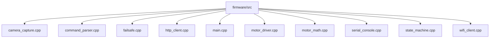

# Module: `firmware/src`

## Overview
Firmware source implementation for the ESP32-CAM runtime, motor control, networking, and safety logic.

## Architecture Diagram

## Submodules
| Submodule | Source | Kind |
| --- | --- | --- |
| `camera_capture.cpp` | `firmware/src/camera_capture.cpp` | C++ source |
| `command_parser.cpp` | `firmware/src/command_parser.cpp` | C++ source |
| `failsafe.cpp` | `firmware/src/failsafe.cpp` | C++ source |
| `http_client.cpp` | `firmware/src/http_client.cpp` | C++ source |
| `main.cpp` | `firmware/src/main.cpp` | C++ source |
| `motor_driver.cpp` | `firmware/src/motor_driver.cpp` | C++ source |
| `motor_math.cpp` | `firmware/src/motor_math.cpp` | C++ source |
| `serial_console.cpp` | `firmware/src/serial_console.cpp` | C++ source |
| `state_machine.cpp` | `firmware/src/state_machine.cpp` | C++ source |
| `wifi_client.cpp` | `firmware/src/wifi_client.cpp` | C++ source |

## Routes
This module does not declare HTTP routes.

## Functions
### `firmware/src/camera_capture.cpp`
- `resolve_frame_size(uint16_t width, uint16_t height)` (function) — No inline docstring/comment summary found.
- `log_camera_error(const char* context, esp_err_t error)` (function) — No inline docstring/comment summary found.
- `camera_capture_init()` (function) — No inline docstring/comment summary found.
- `camera_capture_frame(FrameBuffer& out_frame)` (function) — No inline docstring/comment summary found.
- `camera_capture_release()` (function) — No inline docstring/comment summary found.

### `firmware/src/command_parser.cpp`
- `parse_action(const String& action_text, DriveAction& out_action)` (function) — No inline docstring/comment summary found.
- `command_parser_parse(const String& payload, MotionCommand& out_command, String& out_error)` (function) — No inline docstring/comment summary found.

### `firmware/src/failsafe.cpp`
- `read_estop_pin_active()` (function) — No inline docstring/comment summary found.
- `failsafe_init()` (function) — No inline docstring/comment summary found.
- `failsafe_kick()` (function) — No inline docstring/comment summary found.
- `failsafe_update_inputs()` (function) — No inline docstring/comment summary found.
- `failsafe_watchdog_expired()` (function) — No inline docstring/comment summary found.
- `failsafe_set_estop(bool active)` (function) — No inline docstring/comment summary found.
- `failsafe_estop_active()` (function) — No inline docstring/comment summary found.
- `failsafe_command_expired(const MotionCommand& command, uint32_t now_ms)` (function) — No inline docstring/comment summary found.

### `firmware/src/http_client.cpp`
- `mode_to_string(DeviceMode mode)` (function) — No inline docstring/comment summary found.
- `append_form_field(String& out, const char* boundary, const char* name, const String& value)` (function) — No inline docstring/comment summary found.
- `set_safe_stop(MotionCommand& command, const String& reason)` (function) — No inline docstring/comment summary found.
- `http_client_health_check()` (function) — No inline docstring/comment summary found.

### `firmware/src/main.cpp`
- `setup()` (function) — No inline docstring/comment summary found.
- `loop()` (function) — No inline docstring/comment summary found.

### `firmware/src/motor_driver.cpp`
- `apply_action(DriveAction action, uint8_t left_pwm, uint8_t right_pwm)` (function) — No inline docstring/comment summary found.
- `motor_driver_init()` (function) — No inline docstring/comment summary found.
- `motor_driver_stop()` (function) — No inline docstring/comment summary found.
- `motor_driver_forward(uint8_t left_pwm, uint8_t right_pwm)` (function) — No inline docstring/comment summary found.
- `motor_driver_left(uint8_t left_pwm, uint8_t right_pwm)` (function) — No inline docstring/comment summary found.
- `motor_driver_right(uint8_t left_pwm, uint8_t right_pwm)` (function) — No inline docstring/comment summary found.
- `motor_driver_execute_pulse(const MotionCommand& command)` (function) — No inline docstring/comment summary found.
- `motor_driver_is_busy()` (function) — No inline docstring/comment summary found.
- `motor_driver_update()` (function) — No inline docstring/comment summary found.

### `firmware/src/serial_console.cpp`
- `state_name(FirmwareState state)` (function) — No inline docstring/comment summary found.
- `serial_console_init()` (function) — No inline docstring/comment summary found.
- `serial_console_log_state(FirmwareState from, FirmwareState to, const char* reason)` (function) — No inline docstring/comment summary found.
- `serial_console_log_error(const char* message)` (function) — No inline docstring/comment summary found.
- `serial_console_log_command(const MotionCommand& command)` (function) — No inline docstring/comment summary found.

### `firmware/src/state_machine.cpp`
- `FirmwareStateMachine::step()` (function) — No inline docstring/comment summary found.
- `FirmwareStateMachine::transition_to(FirmwareState next, const char* reason)` (function) — No inline docstring/comment summary found.
- `FirmwareStateMachine::capture_frame()` (function) — No inline docstring/comment summary found.
- `FirmwareStateMachine::upload_frame_for_command()` (function) — No inline docstring/comment summary found.
- `FirmwareStateMachine::execute_pending_command()` (function) — No inline docstring/comment summary found.

### `firmware/src/wifi_client.cpp`
- `wifi_client_connect()` (function) — No inline docstring/comment summary found.
- `wifi_client_is_connected()` (function) — No inline docstring/comment summary found.
- `wifi_client_rssi_dbm()` (function) — No inline docstring/comment summary found.
