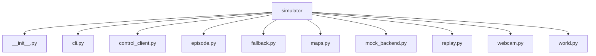

# Module: `simulator`

## Overview
Simulation, replay, and webcam client tooling that exercises the backend without physical hardware.

## Architecture Diagram

## Submodules
| Submodule | Source | Kind |
| --- | --- | --- |
| `__init__.py` | `simulator/__init__.py` | Python module |
| `cli.py` | `simulator/cli.py` | Python module |
| `control_client.py` | `simulator/control_client.py` | Python module |
| `episode.py` | `simulator/episode.py` | Python module |
| `fallback.py` | `simulator/fallback.py` | Python module |
| `maps.py` | `simulator/maps.py` | Python module |
| `mock_backend.py` | `simulator/mock_backend.py` | Python module |
| `replay.py` | `simulator/replay.py` | Python module |
| `webcam.py` | `simulator/webcam.py` | Python module |
| `world.py` | `simulator/world.py` | Python module |

## Routes
This module does not declare HTTP routes.

## Functions
### `simulator/cli.py`
- `parse_args() -> argparse.Namespace` (function) — No inline docstring/comment summary found.
- `main() -> None` (function) — No inline docstring/comment summary found.
- `_add_common_backend_flags(parser: argparse.ArgumentParser) -> None` (function) — No inline docstring/comment summary found.
- `_env_bool(name: str, default: bool) -> bool` (function) — No inline docstring/comment summary found.

### `simulator/episode.py`
- `run_episode(*, config: EpisodeConfig, control_client: ControlClientProtocol, session_id: UUID | None = None) -> EpisodeResult` (function) — Run one simulator-control loop against the backend contract.
- `_encode_jpeg(image: Image.Image, quality: int) -> bytes` (function) — No inline docstring/comment summary found.
- `_build_step_record(*, seq: int, timestamp_ms: int, frame_path: Path, topdown_path: str, frame_width: int, frame_height: int, jpeg_quality: int, state_before: VehicleState, state_after: VehicleState, command: CommandResponse, goal_reached: bool, backend_error: str | None) -> dict[str, object]` (function) — No inline docstring/comment summary found.

### `simulator/fallback.py`
- `build_stop_command(*, seq: int, session_id: UUID, reason_code: str, message: str, safe_to_execute: bool) -> CommandResponse` (function) — Build a local STOP fallback command for simulator-side failures.

### `simulator/maps.py`
- `list_builtin_maps() -> tuple[MapDefinition, ...]` (function) — Return all simulator maps.
- `get_builtin_map(name: str) -> MapDefinition` (function) — Resolve one named simulator map.

### `simulator/mock_backend.py`
- `build_command(seq: int, session_id: UUID | None, action: str, left_pwm: int, right_pwm: int, duration_ms: int, reason_code: str) -> dict[str, object]` (function) — No inline docstring/comment summary found.
- `create_mock_app(config: MockBackendConfig) -> FastAPI` (function) — No inline docstring/comment summary found.
- `parse_args() -> argparse.Namespace` (function) — No inline docstring/comment summary found.
- `main() -> None` (function) — No inline docstring/comment summary found.

### `simulator/replay.py`
- `replay_episode(*, config: ReplayConfig, control_client: ControlClientProtocol) -> ReplayResult` (function) — Replay stored simulator frames through backend and compare actions.
- `_load_steps(path: Path) -> list[dict[str, object]]` (function) — No inline docstring/comment summary found.
- `_read_frame_dimensions(step: dict[str, object]) -> tuple[int, int]` (function) — No inline docstring/comment summary found.
- `_read_int(value: object, *, default: int) -> int` (function) — No inline docstring/comment summary found.

### `simulator/webcam.py`
- `run_webcam_loop(*, config: WebcamConfig, control_client: ControlClientProtocol, session_id: UUID | None = None, capture_factory: CaptureFactory | None = None, frame_encoder: FrameEncoder | None = None) -> WebcamResult` (function) — Capture laptop camera frames and send them to backend control API.
- `_import_cv2() -> Any` (function) — No inline docstring/comment summary found.
- `_build_default_encoder(cv2_mod: Any) -> FrameEncoder` (function) — No inline docstring/comment summary found.
- `_render_preview(*, cv2_mod: Any, frame: Any, command_action: str) -> None` (function) — No inline docstring/comment summary found.
