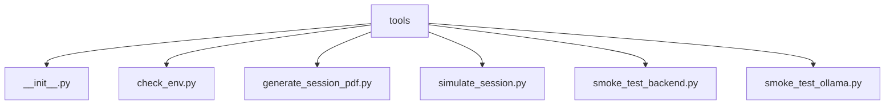

# Module: `tools`

## Overview
Operational utilities for environment validation, smoke testing, and report generation.

## Architecture Diagram

## Submodules
| Submodule | Source | Kind |
| --- | --- | --- |
| `__init__.py` | `tools/__init__.py` | Python module |
| `check_env.py` | `tools/check_env.py` | Python module |
| `generate_session_pdf.py` | `tools/generate_session_pdf.py` | Python module |
| `simulate_session.py` | `tools/simulate_session.py` | Python module |
| `smoke_test_backend.py` | `tools/smoke_test_backend.py` | Python module |
| `smoke_test_ollama.py` | `tools/smoke_test_ollama.py` | Python module |

## Routes
This module does not declare HTTP routes.

## Functions
### `tools/check_env.py`
- `check_python_version(version: tuple[int, int] | None = None) -> CheckResult` (function) — Ensure interpreter satisfies minimum supported version.
- `check_modules(import_fn: Callable[[str], ModuleType] = importlib.import_module, required: Sequence[str] = REQUIRED_MODULES) -> CheckResult` (function) — Validate that required Python modules can be imported.
- `check_required_env_vars(env: Mapping[str, str] | None = None, required: Sequence[str] = REQUIRED_ENV_VARS) -> CheckResult` (function) — Validate required configuration variables are set and non-empty.
- `check_ollama_binary(which_fn: Callable[[str], str | None] = shutil.which) -> CheckResult` (function) — Ensure Ollama CLI is available for local offline inference.
- `render_results(results: Sequence[CheckResult]) -> bool` (function) — Print check summary and return True when all checks pass.
- `parse_args() -> argparse.Namespace` (function) — No inline docstring/comment summary found.
- `main() -> int` (function) — No inline docstring/comment summary found.

### `tools/generate_session_pdf.py`
- `generate_frame(wp: dict) -> Image.Image` (function) — Generate a 320x240 synthetic ego-camera frame.
- `generate_topdown_map(steps: list[dict]) -> Image.Image` (function) — Generate a bird's-eye map showing the path and obstacles.
- `build_pdf(steps: list[dict], output_path: Path) -> None` (function) — Build the complete PDF report.
- `main() -> None` (function) — No inline docstring/comment summary found.

### `tools/simulate_session.py`
- `generate_frame(wp: Waypoint) -> bytes` (function) — Generate a 320x240 synthetic ego-camera frame for the waypoint.
- `run_simulation() -> tuple[list[StepLog], UUID, Path]` (function) — Run full session simulation through the real backend pipeline.
- `query_db_summary(db_path: Path, session_id: UUID) -> dict` (function) — Pull summary stats from the session database.

### `tools/smoke_test_backend.py`
- `main() -> int` (function) — No inline docstring/comment summary found.

### `tools/smoke_test_ollama.py`
- `main() -> int` (function) — No inline docstring/comment summary found.
